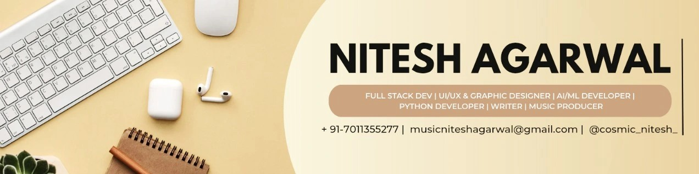

  

<h1 align="center" style="font-size:2.8rem; font-weight:900; color:#32F7A6; text-shadow:0 0 20px #32F7A6, 0 0 40px #222;">
   Hi, I'm Nitesh Agarwal
</h1>

   B.Tech CSE '28 &nbsp;|&nbsp;  Full Stack & AI/ML &nbsp;|&nbsp;  Graphics Head

  

---

<h2 align="center" style="font-size:2rem; color:#FFD700; text-shadow:0 0 10px #FFD700;">
   Achievements
</h2>
<ul style="font-size:1.15rem;">
  <li>🏆 <b style="color:#FFD700;">Technowar Winner (IIT Delhi, Tryst’25)</b></li>
  <li>🚀 <b style="color:#32F7A6;">12+ Hackathons | 6x Finalist</b></li>
  <li>🎨 <b style="color:#FF69B4;">Graphics Head @ Campus Chronicles</b></li>
  <li>✍️ <b style="color:#FFA500;">Author: <i>Finding My Self in the Lies</i></b></li>
</ul>
---

<h2 align="center" style="font-size:2rem; color:#32F7A6; text-shadow:0 0 10px #32F7A6;">
   Connect
</h2>

  
  
  
  

---

<h2 align="center">Tech Stack</h2>

  

---

---

<h2 align="center">GitHub Analytics & Stats</h2>

  
  
  
  

---

  

